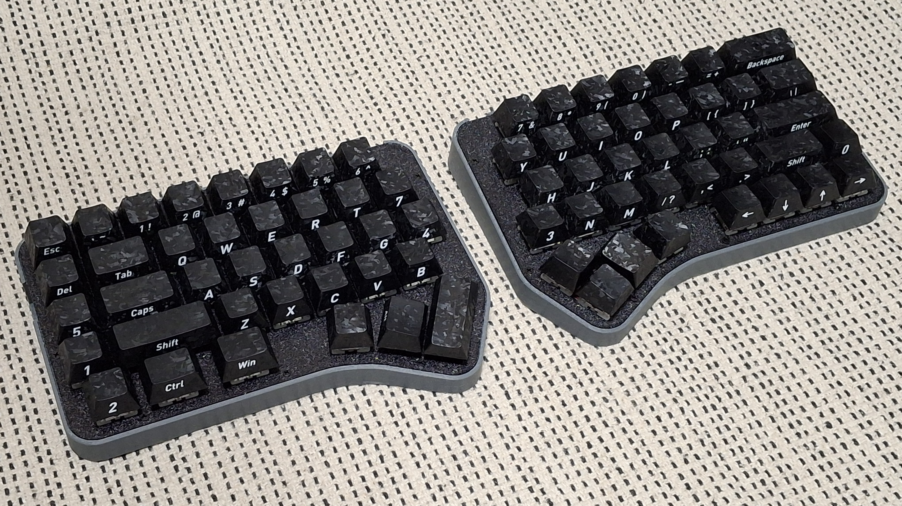
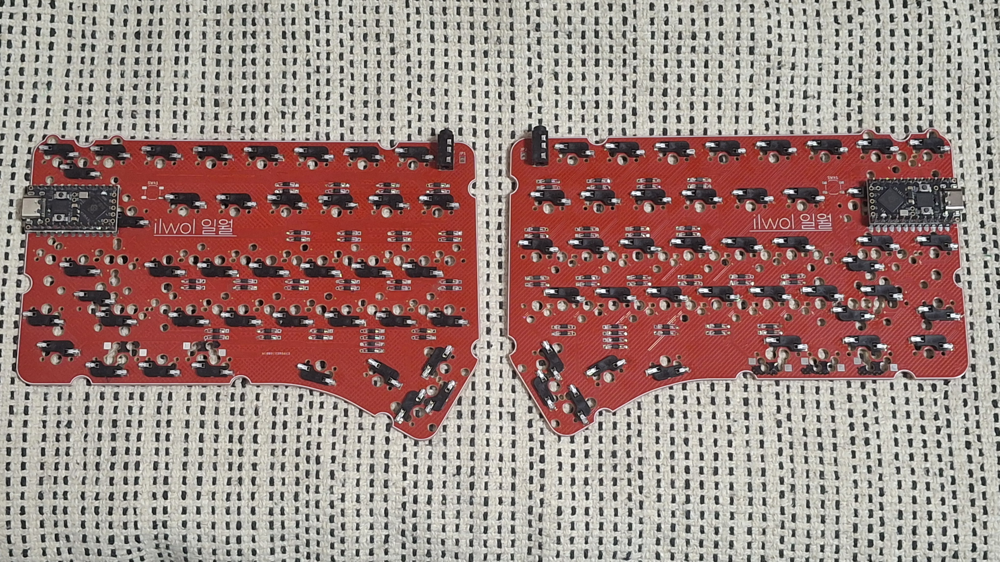
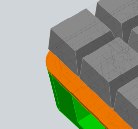
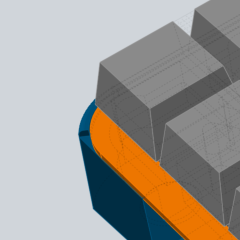
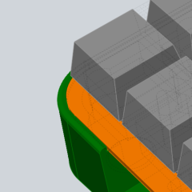
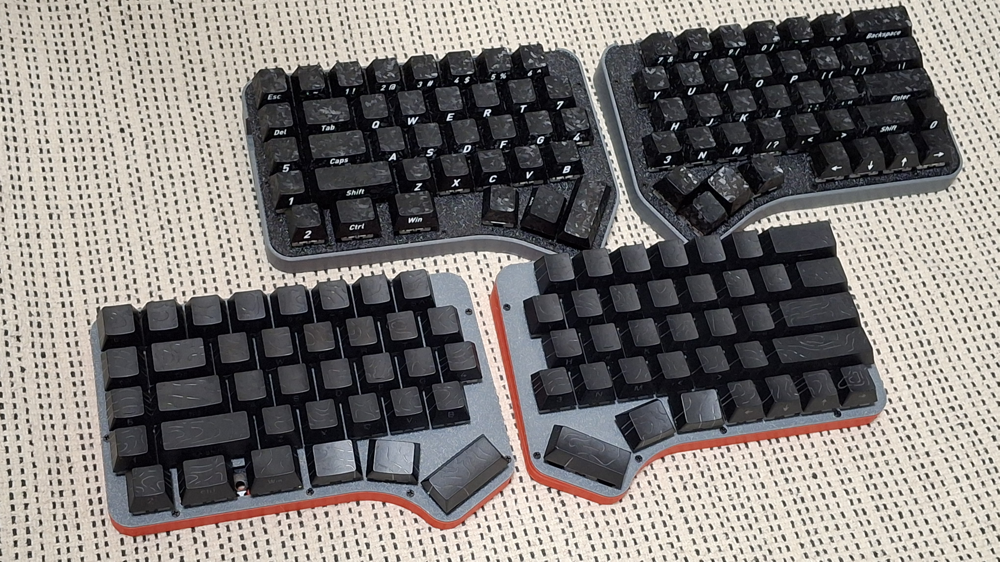
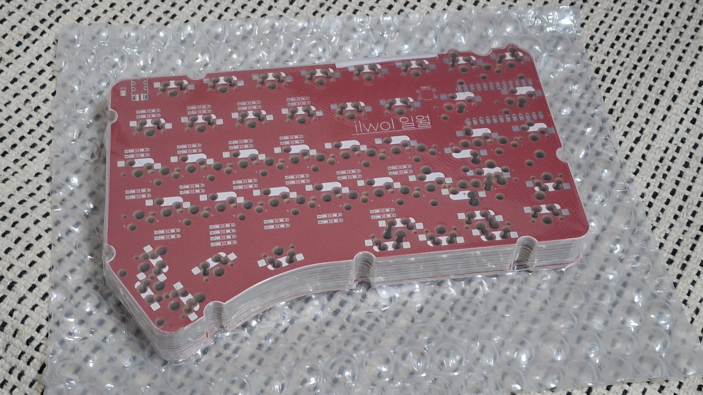

# ilwol
row staggered 60% hotswappable keyboard with reversible PCB, sibling of [phalwol](https://github.com/yuburoll/phalwol)

The name ilwol is January in Korean.

This keyboard has additional Y/H/B keys which positioned between keyboards, and auxilary row at left outside. You may put the keycaps from numpad.

This keyboard has hotswap-only PCB.

ilwol can change layout to followings:

- Split left shift, to ISO shaped one.(2.25u to 1.25u/1u)

- Split right shift, to HHKB inspired shape.(2.75u to 1.75u/1u)

- Split outside thumb keys(2u to 1u/1u)

- Split backspace(2u to 1u/1u)

- Can use stepped caps lock

## Preparation

- 2x pro micro form factor dev board

- 2x ilwol PCB Boards, provided from the repo

- 1x printed case sets, 2 parts total, provided from the repo (for thicker case, use "Buffed". want more? use "roundBuffed")

- 1x 1.5-1.6T keyboard plate sets, 2 parts total, provided from the repo

- 80x diodes, normally 1N4148

- 84x Kailh hotswap sockets (or compatibles)

- 16x M2x6 screws, flathead

- 2x PJ320A 1/8(3.5mm) TRRS connector (MJ-4PP-9 in other name)

- 2x 4x4x1.5mm surface mount tact switches (optional, for dev boards without reset button)

- 1x 1/8(3.5mm) TRRS cable

- 1-6x PCB Mounted 2u Keyboard Stabilizers, normally 6

- 73-78x MX Keyswitches, normally 73

- 8x 10mm bumpon stickers

- A set of Keycaps, Full-size layout, ANSI preferred.

## Differences between case variations

|Original|Buffed|RoundBuffed|
|:---:|:---:|:---:|
||||

## Build Guides and Miscellaneous

[ilwol Build Guide](docs/buildGuide.md)

there's some notices before the build:

- You may solder all hotswaps before soldering the dev board.

- Assemble dev board with 2.5mm height pin headers on back side, assume that components side are faced up.

- Jump every jumpers on front side.

Also take a look at the sibling, [phalwol](https://github.com/yuburoll/phalwol).

## Sponsorship Notice

This project is sponsored by [PCBway](https://www.pcbway.com/), where I ordered prototype PCB.

Their detailed reviewing service was fast and great. I think it will be worth the money for commercial prototyping.

And, they provide complex options (like matte coating on PCB, which pretty surprised me) for both PCB and PCBA, which are necessary for some high-end, important projects.

## Licenses

all codes follow MIT license.

all designs and the hardware board follow CC BY-SA 4.0 license.

Markdown documents and photos in docs/images folder are copyrighted, all rights reserved.

If you want to make a commercial product, it would be appreciated if you sponsor some bucks for me.
